<h1 align="center">INFORME FINAL</h1>

<h2>🔹 Introducción: Explica el objetivo del análisis y el problema de evasión de clientes (Churn).</h2>

<h3>Telecom X - Análisis de Evasión de Clientes</h3>

He sido contratado como asistente de análisis de datos en Telecom X. La empresa enfrenta una alta tasa de cancelaciones y necesita comprender los factores que llevan a la pérdida de clientes.

El desafío es recopilar, procesar y analizar los datos, utilizando Python y sus principales bibliotecas para extraer información valiosa. A partir de éste análisis, el equipo de Data Science podrá avanzar en modelos predictivos y desarrollar estrategias para reducir la evasión.

Se practicará:

✅ Importar y manipular datos desde una API de manera eficiente.

✅ Aplicar los conceptos de ETL (Extracción, Transformación y Carga) en la preparación de los datos.

✅ Crear visualizaciones estratégicas para identificar patrones y tendencias.

✅ Realizar un Análisis Exploratorio de Datos (EDA) y generar un informe con insights relevantes.

<h2>🔹 Limpieza y Tratamiento de Datos: Describe los pasos realizados para importar, limpiar y procesar los datos.</h2>

✅ Se cargó los datos directamente desde la API utilizando Python.

✅ Se convertió los datos a un DataFrame de Pandas para facilitar su manipulación.

✅ Se exploró las columnas del dataset y verificó sus tipos de datos.

✅ Se consultó el diccionario para comprender mejor el significado de las variables.

✅ Se comprobó la existencia de  incoherencias en los datos que puedan afectar el análisis (valores ausentes, duplicados, errores de formato y demás  inconsistencias en las categorías).

✅ Identificadas las inconsistencias, se aplicó las correcciones necesarias para asegurar que los datos estén completos y coherentes

✅ Se creó la columna "Cuentas_Diarias", en base a la facturación mensual, proporcionando una visión más detallada del comportamiento de los clientes a lo largo del tiempo.

✅ Se realizó la estandarización y transformación de datos:

-convertir valores textuales como "Sí" y "No" en valores binarios (1 y 0),

-traducir o renombrar columnas y datos

<h2>🔹 Análisis Exploratorio de Datos: Presenta los análisis realizados, incluyendo gráficos y visualizaciones para identificar patrones.</h2>

<h3>Distribución de clientes activos y que se dieron de baja</h3>

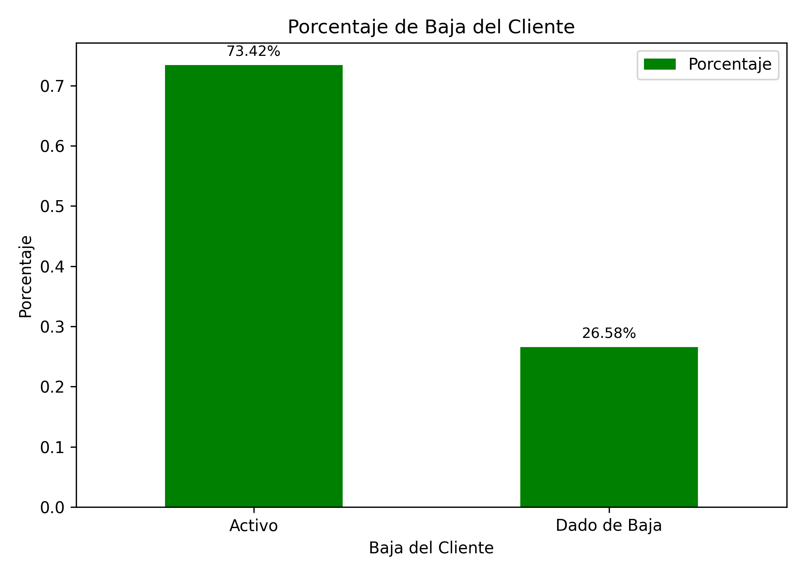

Se observa que el porcentaje de clientes que se dieron de baja es del 26,6%.

Para tratar de encontrar las razones por las que se dieron de baja, se analiza el comportamiento de los clientes en relación a diversas variables categóricas y numéricas:

<h4>1.	Género, Líneas múltiples, TV en Linea, Películas en Línea</h4>

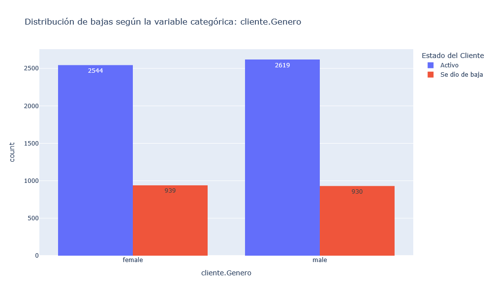

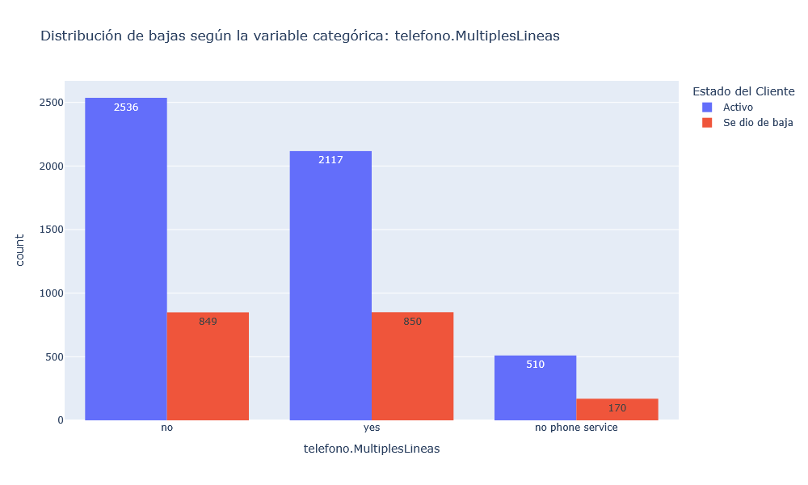

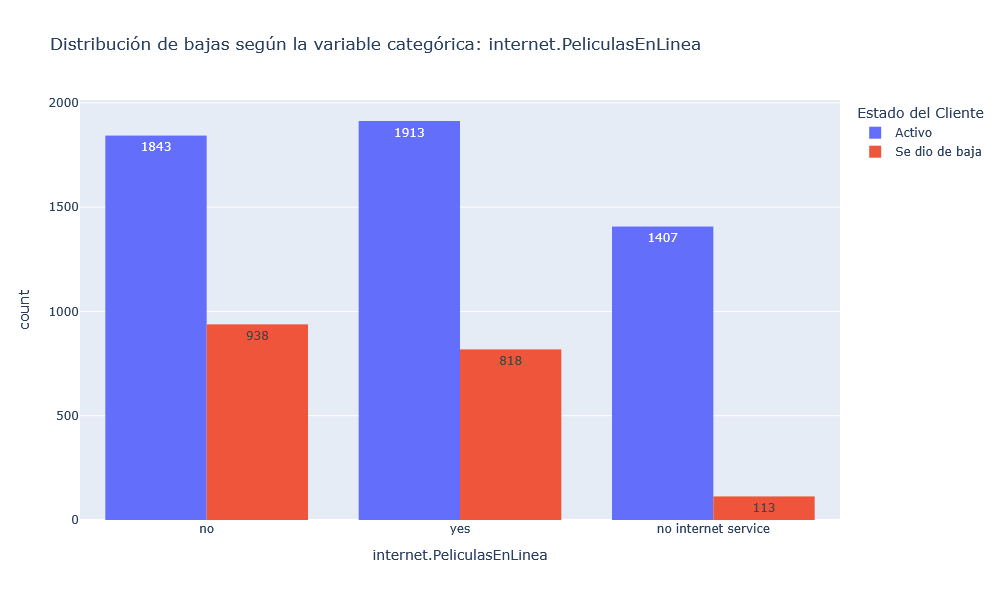

Se puede considerar que en términos generales estas variables no afectan la distribución de las bajas ( la variación de las bajas no es significativa)

<h4>2. Seguridad online</h4>

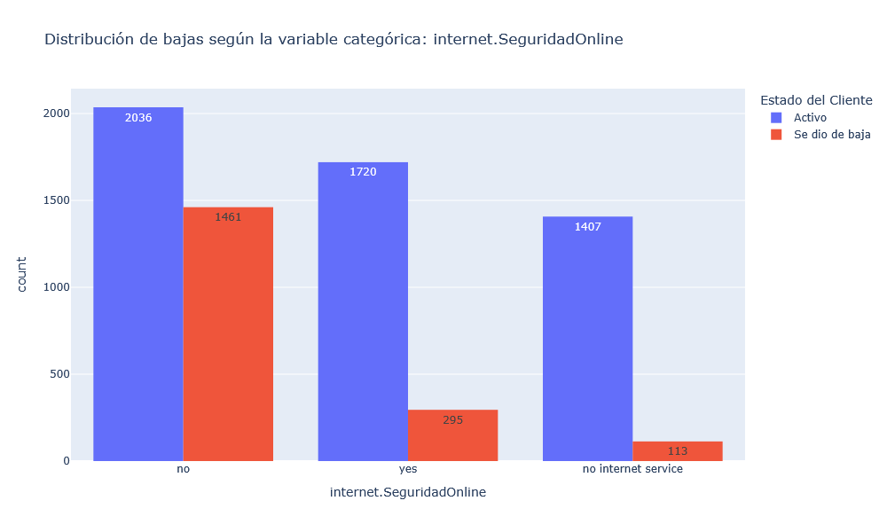

Se observa un notable incremento en el  porcentaje de bajas en los clientes que  no tienen contratado el servicio de seguridad online ( 71,7%) en relación a los que si lo tienen contratado ( 17,1%)

<h4>3. Seguridad del dispositivo</h4>

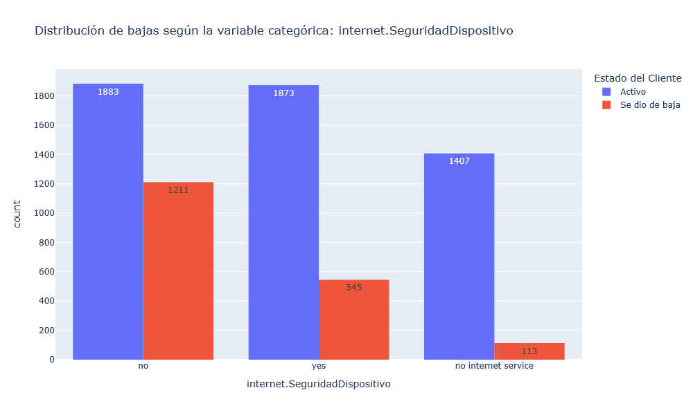

Se observa un notable incremento en el  porcentaje de bajas en los clientes que  no tienen contratado el servicio de Seguridad del dispositivo ( 64,3%) en relación a los que si lo tienen contratado ( 29,1%)

<h4>4. Soporte técnico</h4>

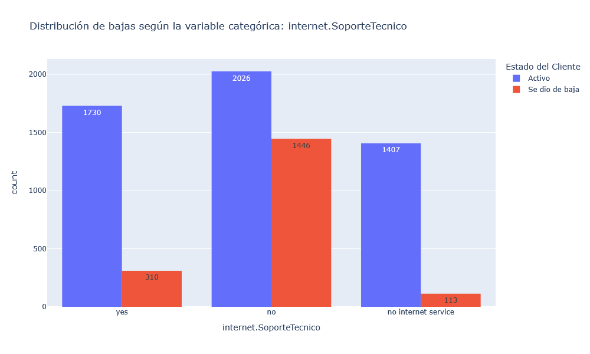

Se observa un notable incremento en el  porcentaje de bajas en los clientes que  no tienen contratado el servicio de Soporte técnico( 71,4%) en relación a los que si lo tienen contratado ( 17,9%)

<h4>5. Backup online</h4>

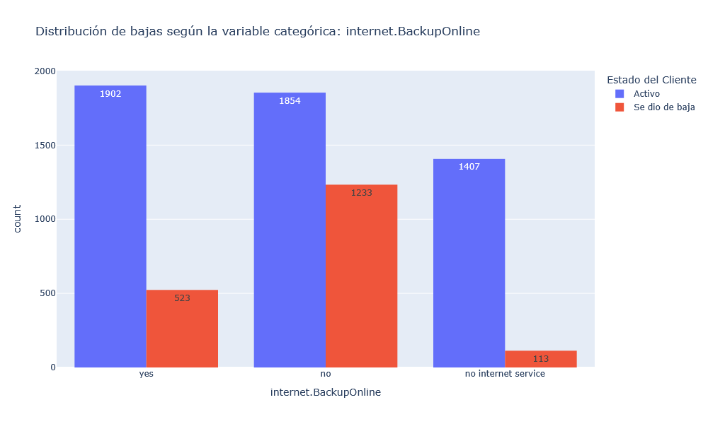

Se observa un incremento significativo en el  porcentaje de bajas en los clientes que  no tienen contratado el servicio de Backup online ( 66,5 %) en relación a los que si lo tienen contratado ( 27,5 %)

<h4>6. Servicio de internet</h4>

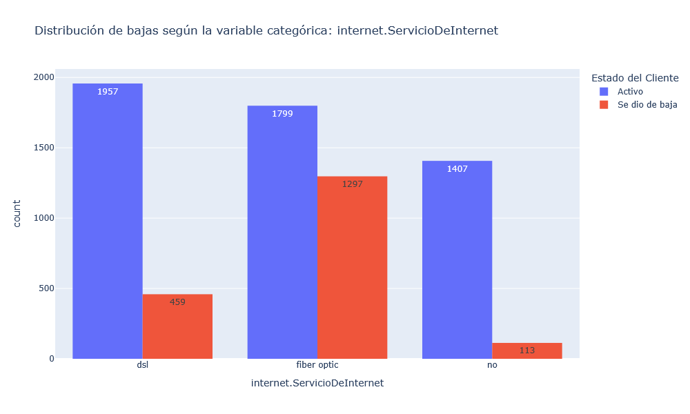

Se observa un notable incremento en el  porcentaje de bajas en los clientes que  tienen contratado el  servicio de internet por fibra óptica (72 %) en relación a los que tienen contratado el servicio de internet por conexión dsl (23.5 %)

<h4>7. Factura electrónica</h4>

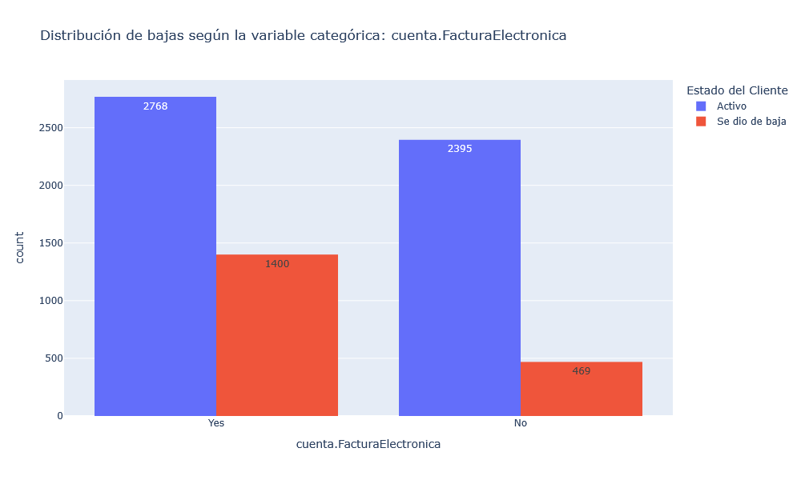

Se observa un incremento considerable en el  porcentaje de bajas en los clientes a los que se les factura electrónicamente (50,5 %) en relación a los que se les factura en papel (19,5 %)

<h4>8. Tipo de Contrato</h4>

Se observa un notable incremento en el  porcentaje de bajas en los clientes que  tienen contrato Mes a Mes (74,5 %) en relación a los que tienen contrato a Un año (12,7 %) y a Dos anos (3 %)

<h4>9. Método de pago</h4>

Se observa un notable incremento en el  porcentaje de bajas en los clientes que  utilizan el cheque electronico como método de pago (82,7 %) en relación a los que utilizan otros métodos de pago (en los que rondan alrededor del 20 %)

<h4>10. Adultos mayores</h4>

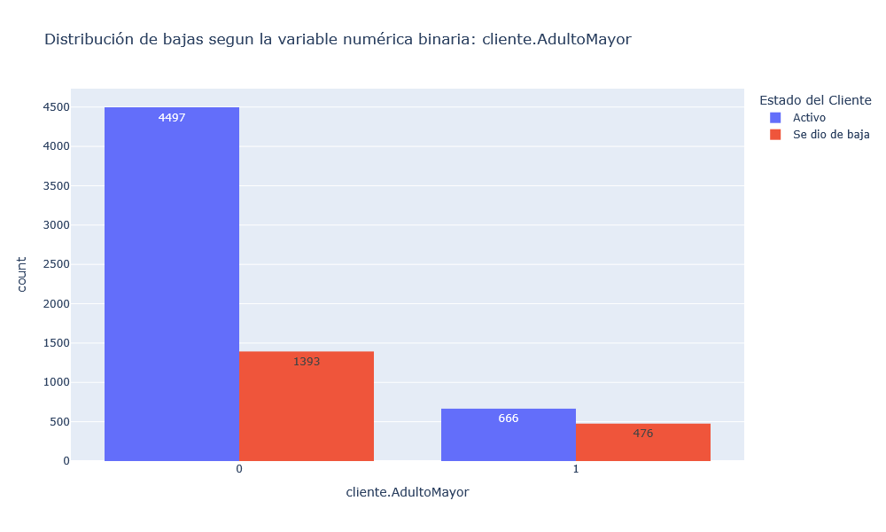

Se observa un notable incremento en el  porcentaje de bajas en los clientes que  son adultos mayores (71,5 %) en relación a los que no lo son (31 %)

<h4>11. Clientes sin pareja</h4>

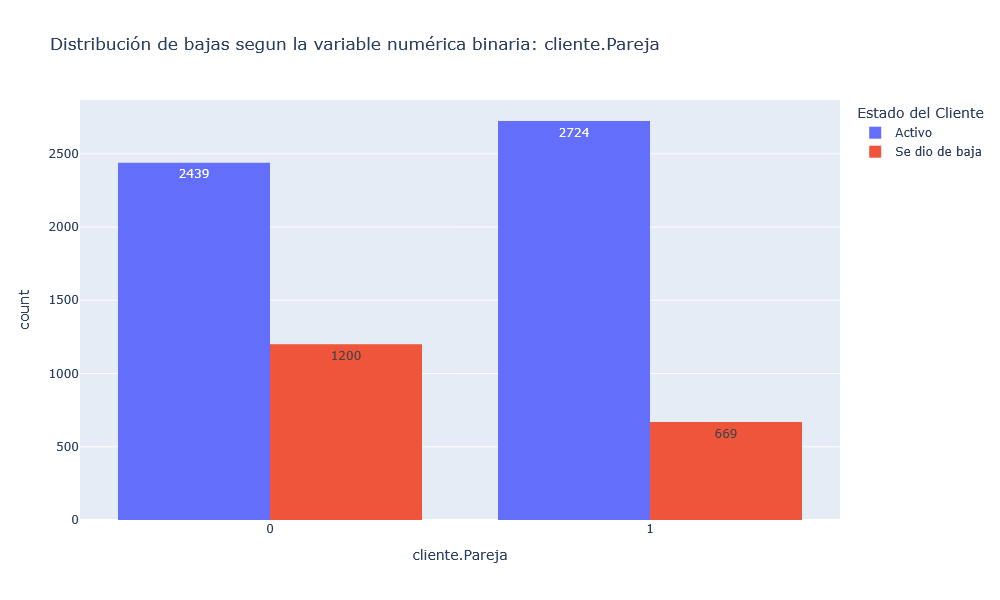

Se observa un  incremento en el  porcentaje de bajas en los clientes que no  tienen pareja (49,2 %) en relación a los que si tienen pareja (24,5 %)

<h4>12. Clientes sin Dependientes</h4>

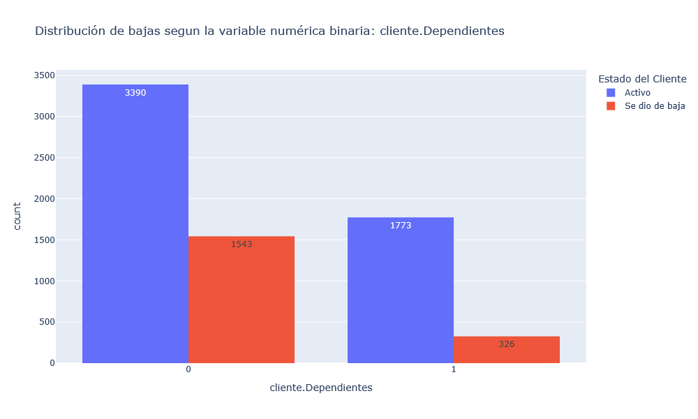

Se observa un incremento en el  porcentaje de bajas en los clientes que  no  tienen dependientes (45,5 %) en relación a los que si los tienen (18,4 %)

<h4>13. Servicio de Telefonía</h4>

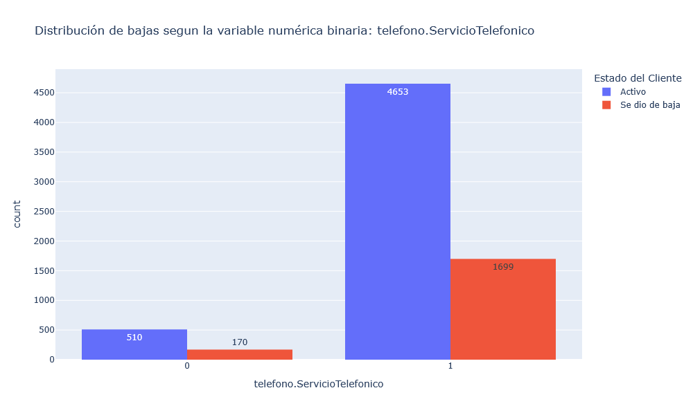

Se puede considerar que en términos generales esta variable no afecta la distribución de las bajas ( la variación de las bajas no es significativa)

<h4>14. Antiguedad</h4>

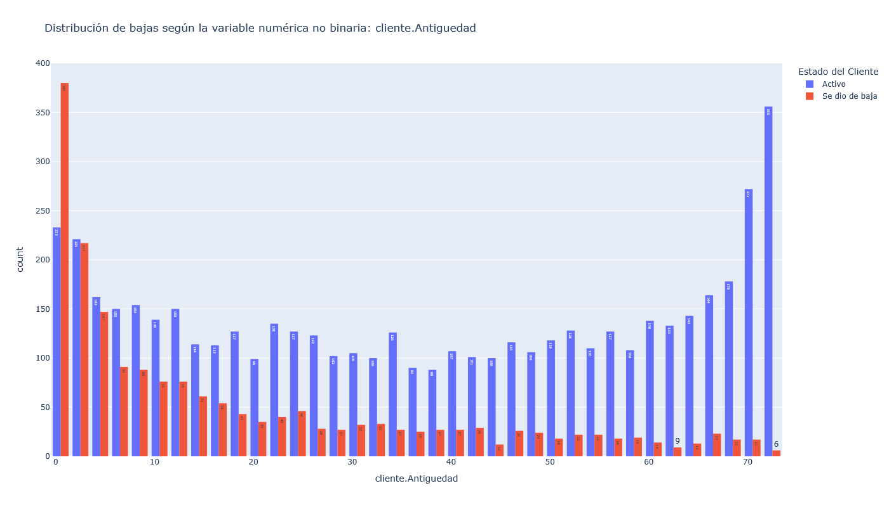

Durante los primeros 5 meses de servicio se observa un alto nivel de bajas, pero siempre en tendencia decreciente. Continúa disminiyendo hasta estabilizarse alrededor del mes 28 en adelante.

<ins>Boxplot</ins>: (Comparación del comportamiento de los clientes activos y los que se dieron de baja tomando como referencia su antiguedad)

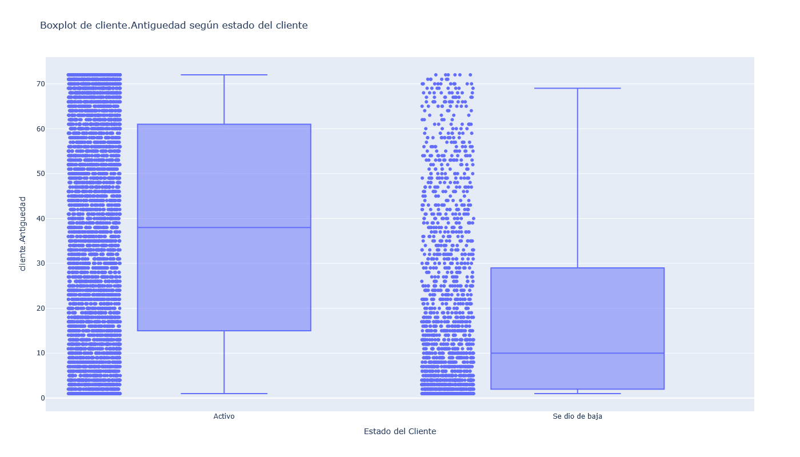

Los clientes activos tienen una distribución simétrica en relación a su antiguedad, siendo la mediana de 38 meses y su valor maximo de 72 meses. En cambio los clientes que se dieron de baja tienen una distribución marcadamente sesgada, ubicandose el 75% de los clientes por debajo de los 30 meses de antiguedad, y siendo su mediana de solo 10 meses.
Esto indica que existe un alto riesgo que un cliente se dé de baja en los primeros 10 meses de la relación contractual.

<h4>15. Costo Total</h4>

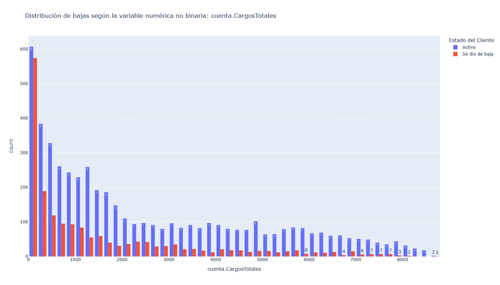

Se observa un alto nivel de bajas cuando el costo total es menor a 400. A medida que aumenta el costo total, el número de bajas disminuye y se estabiliza a partir de los 3000

<ins>Boxplot</ins>: (Comparación del comportamiento de los clientes activos y los que se dieron de baja tomando como referencia el Costo Total que afrontan)

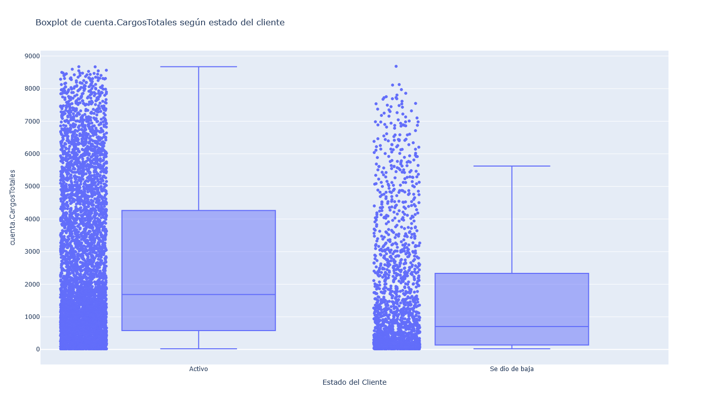

En cuanto a los cargos totales se observa una distribucion sesgada de los clientes activos ubicandose el 75% de los mismos por debajo de los 4260, siendo su valor maximo de 8670. Su mediana es aproximadamente 1680.
Se observa la misma distribución sesgada en los clientes q se dieron de baja, pero con valores aún más bajos. El 75 % de los mismos se ubica por debajo de los 2330 de Costo Total, siendo su mediana de solo 700. Se observan ademas múltiples valores outliers por encima de  los 5625
Se concluye que los clientes que se dan de baja en general tienen un Costo Total inferior a los clientes activos y que mayoritariamente lo hacen cuando el  cargo total es inferior a los 2300. Esto también se explica porque los clientes que se dan de baja lo hacen en general en los primeros meses de la relacion contractual, cuando los costos totales son mas bajos.

<h4>16. Costo Mensual, Costo Diario</h4>

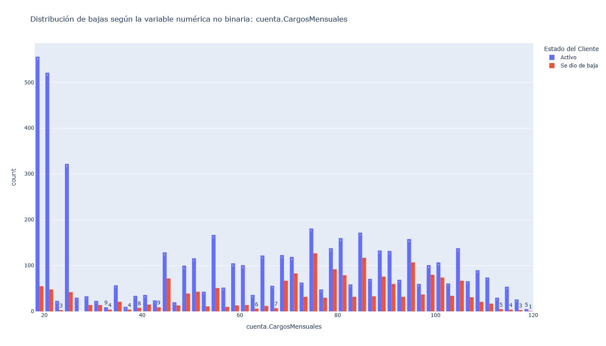

Se observan niveles altos de bajas en 3 tramos marcados de costos mensuales: entre 0 y 26, entre 45 y 56 y entre 68 y 106.

Este mismo comportamiento se observa cuando analizamos los costos diarios:  entre 0 y 0.8, entre 1.6 y 1.9 y entre 2.3 y 3,6

<ins>Boxplot</ins>: (Comparación del comportamiento de los clientes activos y los que se dieron de baja tomando como referencia el Costo Mensual y/o diario que afrontan)

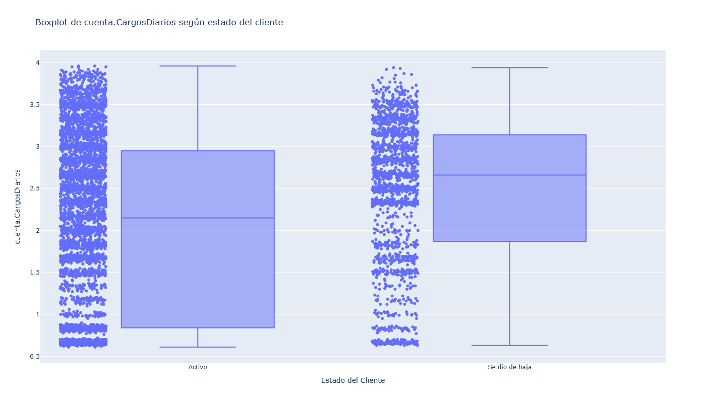

La distribución de los clientes segurn los cargos mensuales y diarios es la misma.

Se observa una distribución ligeramente sesgada  en los clientes activos, ubicandose el 50% central de los mismos entre 25 y  88,5 mensuales (0.84 y 2,95 diarios), siendo su mediana de 64,5 mensuales (2,15 diarios) y asumiendo un valor máximo de 118,7 mensuales (3,96 diarios)

La distribución de los clientes q se dieron de baja es mas simetrica, pero se observan valores mas altos, ubicandose el rango intercuartílico entre 56 y 94 mensuales ( 1,87 y 3,14 diarios) siendo su mediana de 79,6 mensuales (2.66 diarios)

Esto indica que en general los clientes q se dan de baja tienen un cargo mensual y/o diario más alto que los clientes activos.

En general se observa una mayor dispersión de los clientes activos en relación a los que se dan de baja cuando se tienen en cuenta cualquiera de las variables númericas no binarias.

<h2>🔹 Conclusiones e Insights: Resume los principales hallazgos y cómo estos datos pueden ayudar a reducir la evasión.</h2>

1.	Uno de cada 4 clientes abandona la companía.

2.	Se observa una significativa tasa de fuga en los  clientes que usan el cheque electrónico como método pago, en relación a los demás métodos de pago (Cheque por Correo, Transferencia Bancaria y Tarjeta de Crédito)

3.	La mayor parte de los clientes que la abandonan tienen contratos de tipo Mes a Mes (de corto plazo)

4.	Abandonan más los clientes que tienen servicio de Internet con fibra óptica en relación a los que tienen Dsl.

5.	Los clientes que no cuentan con servicios adicionales (Seguridad Online, Backup Online, Seguridad del Dispositivo y Soporte Técnico) suelen dejar la compañía con mayor frecuencia.

6. El porcentaje de renuncias en los adultos mayores es muy alto

7.	Los clientes con pocos meses de permanencia (antiguedad) son los más propensos a irse.

     Esto también tiene una relación directa con el comportamiento de los clientes con contratos mes a mes.

8.	Los clientes que se dan de baja suelen tener cargos totales significativamente más bajos que los clientes activos. Esto se explica porque la fuga ocurre más frecuentemente en las etapas iniciales de la relación comercial, antes de que acumulen un costo total mas elevado.

9. Los clientes que se dan de baja tienen en general cargos mensuales y/o diarios más altos en comparación con los clientes activos.

   Esto sugiere una insatisfacción con el valor percibido en relación con el precio abonado.

10.	Se observa un incremento en la  tasa de fuga en los clientes que optan por la facturación electrónica en relación a los que se les factura en papel.

11. También se observa un incremento en la tasa de baja de los clientes sin pareja y/o sin dependientes a su cargo.

<h2>🔹 Recomendaciones: Ofrece sugerencias estratégicas basadas en tu análisis.</h2>

1. El hecho de que los clientes que se van pagan mensualmente más por el servicio que los clientes que continúan activos, sumado a que la baja ocurre más en las etapas tempranas de la relación, pone en evidencia un desajuste entre el precio del servicio y el valor percibido por el cliente, especialmente en los inicios de la relación. El cliente percibe que está pagando mucho por el servicio que recibe.

   Se recomienda que la empresa ofrezca promociones, especialmente al inicio de la relación contractual, para lograr la fidelización del cliente. Una vez que el cliente se acostumbra al servicio, lo considera como esencial, lográndose el mantenimiento del mismo.

2. Al parecer la flexibilidad de los contratos 'Mes a mes' facilita el abandono del servicio. En contraste, los contratos a '1 año' y '2 años' muestran tasas de fuga significativamente menores, indicando una mayor estabilidad y compromiso de los clientes.

   Es por ello que se deberían implementar ofertas atractivas o beneficios exclusivos para que los clientes opten por contratos a mediano y largo plazo.

3.	Se deberían investigar posibles fallas en el servicio  de Internet por fibra óptica. Prestar atención a los reclamos hechos por los clientes y  de ser necesario realizar inversiones en infraestructura que mejoren la estabilidad del servicio y el desempeño de los equipos de soporte técnico.

4. 	En cuanto a los Métodos de Pago, para los clientes que usan 'Cheque Electrónico', investigar posibles deficiencias en el proceso de pago y demás causas que los llevan a darse de baja. Mientras tanto promover los demás  métodos de pago a través de incentivos.

5. En relación a los servicios adicionales (Seguridad Online, Backup Online, Seguridad del Dispositivo y Soporte Técnico)  la compañía debería ofrecerlos como servicios incluídos en los planes contratados, especialmente a modo de promoción para lograr la fidelización del cliente.

   Quizás las demás companías ya  incluyen estos servicios en los planes que les ofrecen a sus clientes, y por ello la alta tasa de bajas en relación a esos servicios.

6. 	En cuanto a la Facturación electrónica se debería investigar las razones detrás de la alta tasa de bajas. Quizás la experiencia digital no sea buena o falten más canales de comunicación. Se debería mejorar la aplicación móvil, o la página web de la companía, ofreciendo canales de soporte más eficientes.

7. Por último, en relación a los adultos mayores, los clientes solteros y los clientes sin dependientes, se debería estudiar el mercado de este tipo de clientes para revelar que los motiva a darse de baja, y ofrecer planes especialmente pensados para ellos.
